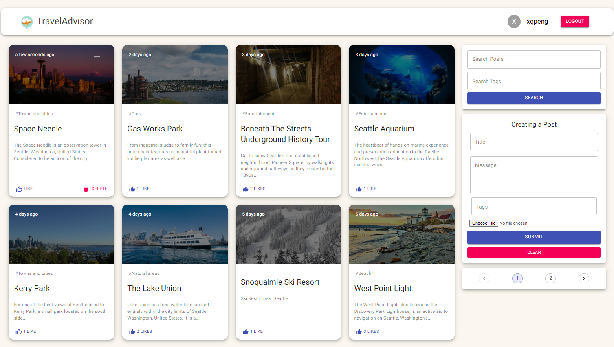
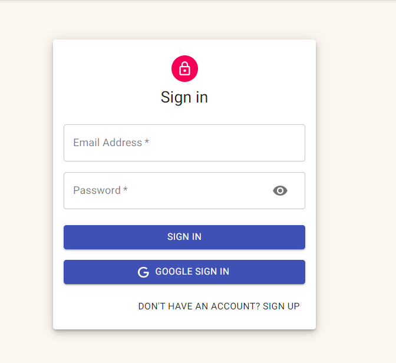
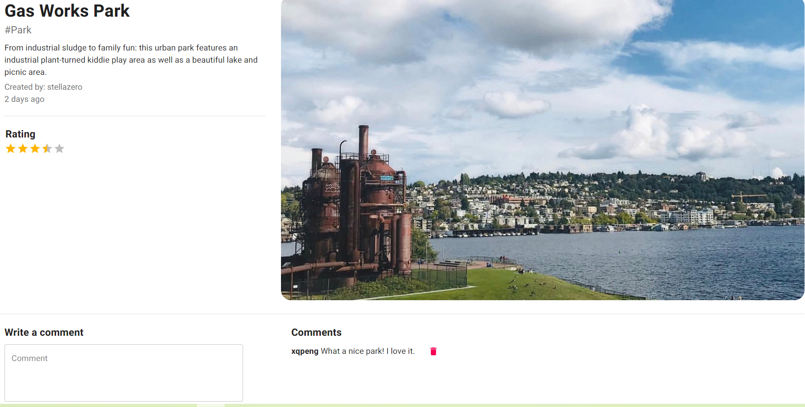
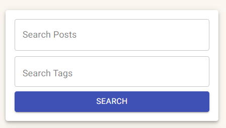

# Project 3: Trip Review App.

### Team member: Andi Dong and Qiong Peng
### Server Link: https://travel-advisor-seattle.herokuapp.com/
### Github Link: https://github.com/CS5610TravelAppTeam/Qiong-Peng-Andi-Dong-Assignment3

## 1. Project Introduction

A Full stack MERN website for travellers where user can search for interests or fun places and filter by rating and dates that are available,
and users can add fun places to the list and much more.

## 2.What were some challenges you faced while making this app?

1. This is our first time combine front-end and back-end together, how to save data to backend and get data from backend would be our first challenge.
2. For the frontend, design the UI component would be a big challenge since we are gonna think from a users side instead of developers.
3. How to transfer data using redux is another challenge since this is a full stack app with real function, we need to design different kinds of reducers to store different kinds of data.
4. For the backend, connecting mongodb atlas with server routes, and with frondend api is chanllenging. We need to make sure they connect and pass data successfully.
5. For delopyment on Heroku, there are some configurations we need to set.

## 3.Given more time, what additional features, functional or design changes would you make

1. We will add a developer component here to manage users' data and information.
2. We will add ads components to make it more like a real application.
3. We will have more functions for example if the user like a place, they could buy tickets and book hotels or even restaurants in our website.
4. We will have a rank components and lists the most favorite places for travellers.
5. We will add Realtime chat function for users to chat details in a post.

## 4. What assumptions did you make while working on this assignment?

1. we assumed that all the users are willing to explore new places and share feelings and experience with others.
2. We assumed that all the users are be able to create a post with the right information in case those posts mislead other users.
3. We assumed that all the users could interact with posts and other people's reviews in the right way.

## 5. How long did this assignment take to complete?

It takes us three weeks working on this project.

## 6. Core Functionality and Bonus Points
### 6.1 Core Functioinality

Guests can read posts and reviews, while loggin users can create/delete post and comment they created.
<h3> Built with  </h3>
<ul>
  <li>FrontEnd: <b> React.JS, Redux Library, Bootstrap, HTML/CSS </b></li>
  <li>Backend:  <b> Node.JS, Express.JS, bcrypt </b> </li>
  <li>Database: <b> MongoDB, Mongoose </b> </li>
  <li>Deploy:   <b> Heroku</b> </li>
</ul>

<h3> Features </h3>
<ul>
  <li> Sign In / Sign Up / Sign Out the user. </li>
  <li> Recieving a welcoming email when sign-up using Nodemailer. </li>
  <li> Add/delete a post to the list.</li>
  <li> Review/delete a post when Sign in.</li>
  <li> Rating a post when Sign in.</li>
  <li> Search posts based on tags or title</li>
</ul>

### 6.2 Password Encryption

The application uses bcrypt package to encrypt password.

### 6.3 Rated Reviews

Loggin users can rate any post.
### 6.4 Search Entries

The application supports two search ways:search by title and search by tags.

## 7. Installation
Please open two terminals to run server and client respectively.
### 7.1 Install server

```bash
npm install
```

### 7.2 Install client

```bash
cd client
```

```bash
npm install
```

### 7.3 Run server

```bash
cd server
```

```bash
node index.js
```

### 7.4 Run client

```bash
cd client
```

```bash
npm start
```

## 8.References
### 8.1 MERN materials and tutorial
<ul>
<li>https://github.com/orifmilod/iCinema</li>
<li>https://github.com/Johnspeanut/project_mern_memories</li>
<li>https://www.youtube.com/playlist?list=PL6QREj8te1P7VSwhrMf3D3Xt4V6_SRkhu</li>
<li>https://www.youtube.com/watch?v=rwdRgmqxDQA&list=PLmOn9nNkQxJFJXLvkNsGsoCUxJLqyLGxu&index=81</li>
</ul>

### 8.2 MERN App Deploment setting on heroku
<ul>
<li>https://www.youtube.com/watch?v=2AIL1c-cJM0</li>
</ul>
